# RESTful API 설계 원칙
1. 자원 중심의 설계
   - RESTful API는 서버가 다루어야 할 자원에 집중해 설계해야 함
   - 서버가 어떤 자원을 다루어야 하는지를 나타내는 명사를 중심으로 URI 설계(자원을 어떻게 해야 하는지 나타내는 동사X)
  
    | 주소 | 내용 |
    | :---: | :---: |
    | `/members` | 회원목록 |
    | `/members/1` | 아이디가 1인 회원 |
    | `/articles` | 게시글 목록 | 
    | `/articles/1` | 아이디가 1인 게시글 |
    | `/members/1/articles` | 아이디가 1인 회원이 작성한 게시글 목록 |
2. HTTP 메서드를 사용한 의도 구현
   - 다루어야 할 자원을 대상으로 RESTful API의 URL을 설계했다면 HTTP 메서드 타입으로 자원을 어떻게 할 것인지를 나타내 활용하면 됨
   - RESTful API의 호출 목적이 회원 목록을 조회(GET)하기 위한 것인지, 회원 정보를 새롭게 생성(POST) 하거나 수정(PUT)하려는 것인지 등을 HTTP 메서드 타입으로 구분하면 됨

    | 타입 | 주소 | 내용|
    | :---: | :---: | :---: |
    | GET | `/members` | 회원 목록을 조회합니다. |
    | GET | `/members/1` | 아이디가 1인 회원을 조회합니다. |
    | POST | `/members` | 회원을 생성합니다.
    | PUT | `/members/1` | 아이디가 1인 회원을 수정합니다. |
    | DELETE | `/members/1` | 아이디가 1인 회원을 삭제합니다 |

3. 정확하고 일관된 URI 설계
   - RESTful API를 설계할 때 URI는 동사를 포함하면 안되며, 명사형으로 사용하되 소문자와 복수형을 사용하는 것이 일반적(언더스코어(`_`도 사용X)

4. HTTP 상태 코드로 응답
   - RESTful API는 클라이언트의 요청을 처리하고 그 결과를 HTTP 상태 코드로 명확하게 전달해야 함

    | HTTP 상태코드 | 의미 |
    | --- | --- |
    | 200 OK | 요청을 정상적으로 처리했을 때 |
    | 201 Created | 요청에 따라 자원을 정상적으로 생성했을 때 | 
    | 400 Bad Request | 요청 정보가 잘못되었을 때 |
    | 401 Unauthorized | 요청을 처리하기 위해 인증이 필요할 때 |
    | 403 Forbidden | 요청에 대한 권한이 없을 때 |
    | 404 Not Found | 요청의 대상 자원이 없을 때 |
    | 500 Internal Server Error | 서버 오류가 발생했을 때 |

5. 무상태성
   - 서버는 클라이언트의 요청들을 처리할 때 어떠한 상태 정보도 저장하지 않아야 하며 모든 요청은 그 자체로서 독립적으로 처리되어야 함
   - 클라이언트의 요청에 대해 어떤 상태 정보를 기억해두고 있다가 그 다음 요청에 대해 해당 상태 정보로 하여금 영향을 미치게 해서는 안됨
   - ex: 택배 배송 정보 조회를 위해 운송장 번호를 조회함 → 배송 정보를 수정하거나 삭제하려고 할 때에도 운송장 번호를 각 요청마다 함께 보내야 함
  
6. 계층화 구조
   - RESTful API 아키텍처에서 클라이언트와 서버 사이에 여러 개의 계층이 있어도 된다는 것을 의미
   - 클라이언트와 서버 사이에 로드 밸런서나 API Gateway가 있을 수도 있고, 어떤 경우에는 인증 서버가 있을 수도 있음
   - 이러한 계층은 기능을 각각의 계층이 담당하도록 나누는 역할을 위해 필요하지만, 클라이언트 입장에서는 알 필요도 없고 그저 투명하게 보임
   - 계층화 구조는 역할이 분리되어 유지보수가 쉽고 계층별로 독립적으로 확장할 수 있어 유연한 시스템을 구축할 수 있음
  
7. 클라이언트 서버 구조
   - 클라이언트 서버 구조란 클라이언트는 사용자 인터페이스(UI)를 담당하고 서버는 데이터와 로직으로 비즈니스를 처리한다는 것을 의미
   - 서버는 RESTful API를 사용해 상품 목록을 JSON으로 전달하고 클라이언트는 JSON으로 전달 받은 상품 목록을 모바일 앱이나 브라우저 화면을 사용해 사용자에게 보여줌으로 두 역할을 분명하게 분리함

8. 캐시 가능
   - RESTful API 서버가 응답에 Cache-Control 헤더를 설정해 클라이언트나 그 중간에 있는 서버가 응답 데이터를 캐싱할 수 있도록 함
   - 캐싱을 통해 동일한 요청에 대해 캐싱되어있는 응답을 사용함으로써 속도를 높일 수 있음
   - 일반적으로 GET 요청에 대해서는 캐싱을 하지만 POST/PUT/DELETE에는 캐싱을 하지 않음

# CRUD
- 생성(Create)
- 조회(Read)
- 수정(Update)
- 삭제(Delete)
## JPA로 RESTful API 서버 만들기
- 이를 위해 컨트롤러와 리포지터리를 작성해야 함
- 컨트롤러
  - 클라이언트의 요청을 받아 처리하고 그 결과를 다시 클라이언트에게 전달해주는 컴포넌트
  - 클라이언트에 데이터를 전달하는 최전방에 위치
  - `표현 계층(Presentation Layer)`라고도 함
- 리포지터리
  - 애플리케이션 내부에서 데이터베이스에 접근해 회원 또는 게시글 정보를 저장 관리하는 역할
  - `데이터 영속성 계층(Data Persistence Layer)`라고도 함
- 컨트롤러와 리포지터리는 모두 스프링 빈 객체
- 스프링 컨테이너에 등록되어 필요에 따라 서로 의존성이 주입됨

# 프로젝트 생성
## 스프링 이니셜라이저
## 설정
- 인코딩 설정을 UTF-8로 수정 → 안하면 한글 내용 모두 ?로 바뀜
- application.properties에서 H2 콘솔 기능 활성화
    ```
    spring.h2.console.enabled=true
    ```
    - 서버 실행 후 주소는 `http://localhost:8080/h2-console/`
    #### 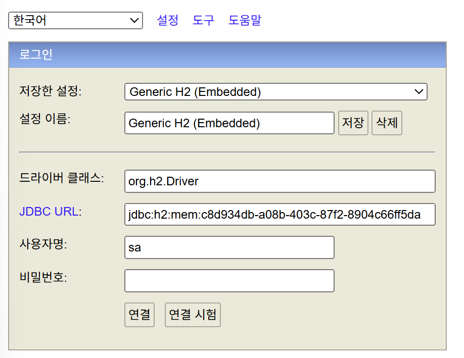
    - JDBC URL은 로그에서 찾아서 붙여넣기
    #### 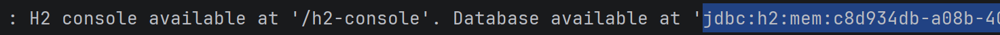
    #### 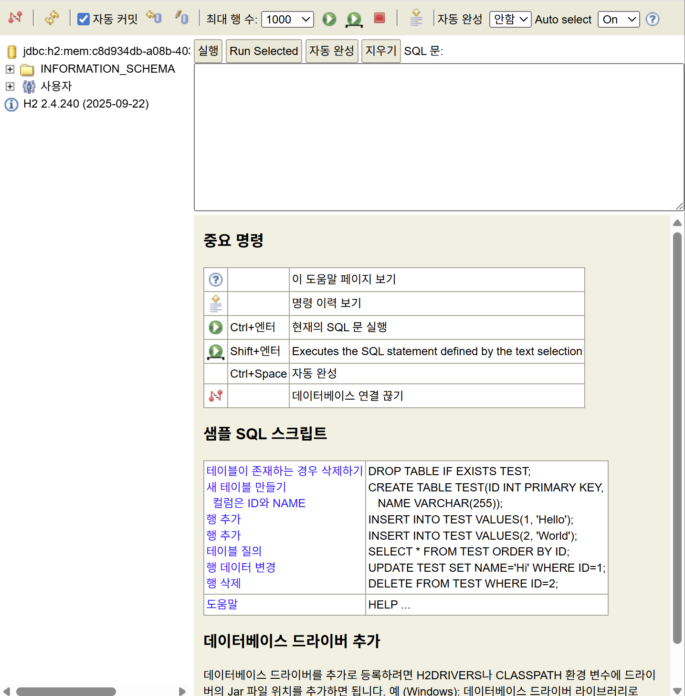
## 회원 엔티티 및 리포지터리 생성
#### 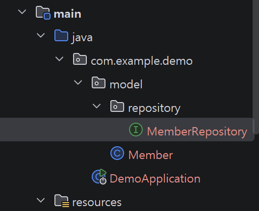
```java
// model/Member.java
package com.example.demo.model;

import jakarta.persistence.Entity;
import jakarta.persistence.GeneratedValue;
import jakarta.persistence.GenerationType;
import jakarta.persistence.Id;
import lombok.Data;

@Entity
@Data
public class Member {
    @Id
    @GeneratedValue(strategy = GenerationType.IDENTITY)
    private Long id;
    private String name;
    private String email;
    private Integer age;
}
```
```java
// model/repository/MemberRepository.java

package com.example.demo.model.repository;

import com.example.demo.model.Member;
import org.springframework.data.jpa.repository.JpaRepository;

public interface MemberRepository extends JpaRepository<Member, Long> {

}
```
## 회원관리 RESTful API 작성
- 만들 리포지터리
  
    | 동작 | HTTP메서드 | URI |
    | :---: | :---: | :---: |
    | 회원 생성 | POST | `/api/members` |
    | 회원 목록 조회 | GET | `/api/members` |
    | 회원 조회 | GET | `/api/members/{회원아이디}` |
    | 회원 수정(전부) | PUT | `/api/members/{회원아이디}` |
    | 회원 수정(일부) | PATCH | `/api/members/{회원아이디}` |
    | 회원 삭제 | DELETE | `/api/members/{회원아이디}` |

- URI는 모두 `/api`로 시작
- 일반적으로 RESTful API라는 것을 표현하기 위해 /api로 시작
- 나중에 API 버전을 올리게 되면 `api/v2`와 같이 버전을 추가하기도 함
- RESTful API를 처리하는 클래스를 `컨트롤러`라고 함
- 프로젝트 소스 폴더에 `controller`라는 패키지를 만들고 `MemberController 클래스`를 작성
- `@RestController`는 이 클래스가 RESTful API를 제공하는 컨트롤러라는 의미로, 애플리케이션을 시작할 때 스프링 프레임워크에 의해 스프링 빈 객체로 만들어져 스프링 컨테이너에서 관리됨
- 클래스 이름에 사용된 `@RequestMapping("/api/members/")` 애노테이션은 이 컨트롤러가 `/api/members/`로 시작하는 모든 클라이언트의 요청을 처리한다는 의미
- 이 컨트롤러에서는 회원 정보를 데이터베이스와 연동하기 위한 MemberRepository 객체를 생성자를 통해 주입받도록 롬복에서 제공하는 `@RequiredArgsConstructor` 애노테이션이 사용됨

``` java
package com.example.demo.controller;

import com.example.demo.model.repository.MemberRepository;
import lombok.RequiredArgsConstructor;
import org.springframework.web.bind.annotation.RequestMapping;
import org.springframework.web.bind.annotation.RestController;

@RestController
@RequestMapping("/api/members")
@RequiredArgsConstructor
public class MemberController {
    private final MemberRepository memberRepository;

}
```

### 생성하기
- 생성을 위해 POST /api/members를 처리할 메서드 작성
- 메서드의 이름은 어떠한 것도 상관 없지만, API의 목적을 잘 반여할 수 있는 이름으로 작성하는 것이 좋음
- `@PostMapping` : `HTTP 메서드 중 하나인 POST로 전달된 요청을 처리`한다는 의미
- 컨트롤러 클래스에 적용된 `@RequestMapping("/api/members")`에 대해 POST 요청 시 이 메서드가 호출됨
- 메서드는 파라미터로 Member객체를 전달받는데, `@RequestBody`는 클라이언트가 보낸 요청 본문으로부터 Member객체를 만들어 컨트롤러의 파라미터로 전달함
```java
// controller/MemberController.java
package com.example.demo.controller;

import com.example.demo.model.Member;
import com.example.demo.model.repository.MemberRepository;
import lombok.RequiredArgsConstructor;
import org.springframework.web.bind.annotation.PostMapping;
import org.springframework.web.bind.annotation.RequestBody;
import org.springframework.web.bind.annotation.RequestMapping;
import org.springframework.web.bind.annotation.RestController;

@RestController
@RequestMapping("/api/members")
@RequiredArgsConstructor
public class MemberController {
    private final MemberRepository memberRepository;

    @PostMapping
    public Member post(@RequestBody Member member) {
        return memberRepository.save(member);
    }
}
```
- `memberRepository.save()`를 사용해 클라이언트로부터 전달받은 Member객체를 데이터베이스에 저장함
- `save()`가 반환된 Member객체에는 엔티티 모델 객체를 작성할 때 사용한 `@GeneratedValue`에 의해 자동 생성된 기본 키가 포함되고, 이를 다시 클라이언트에게 반환함
#### 사용자 생성 RESTful API를 완성했으니 테스트 진행
- 인텔리제이를 통해 서버 실행
- 포스트맨을 사용해 요청 내용 설정
#### 
- `Content-Type` - `application/json` : 콘텐츠 종류가 JSON 형식임을 알려주기 위함
- `Accept` - `application/json` : 요청을 보내는 클라이언트가 JSON 형식을 받아들일 수 있으니 결과를 JSON으로 보내달라는 의미
#### 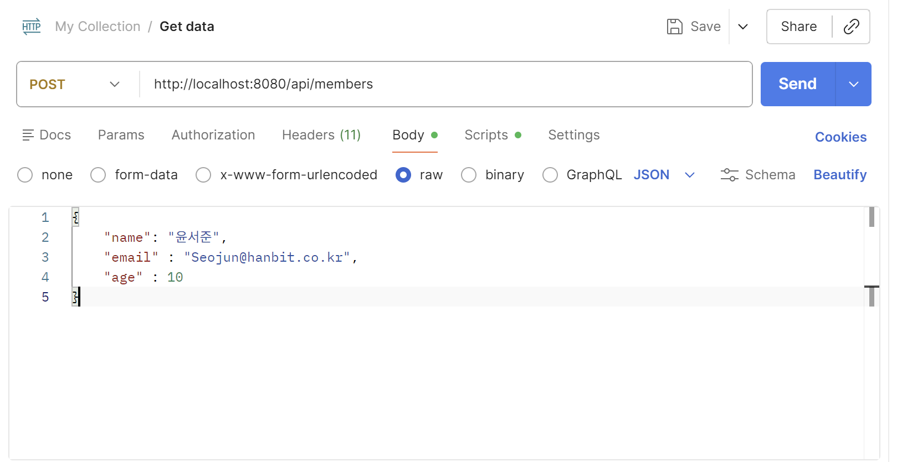)
#### 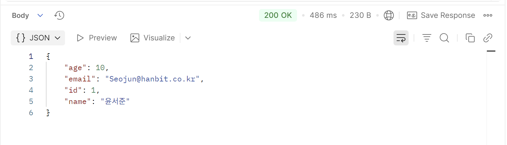
- 결과값엔 자동으로 생성된 기본키(id)가 포함되어 있음
#### 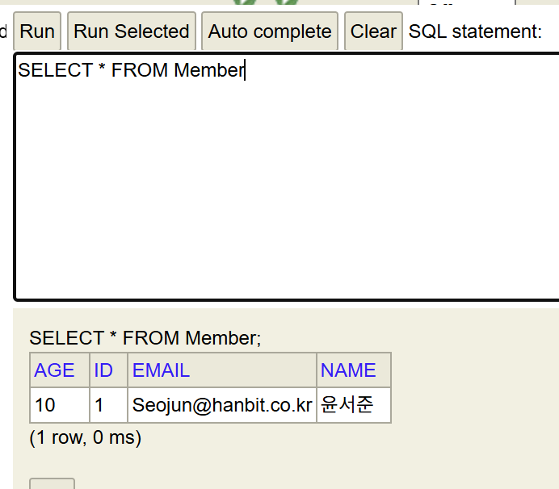
- H2콘솔에서 DB에 저장되었음을 확인할 수 있음

### 전체 조회하기
- 데이터베이스에서는 전체 회원 목록을 조회하거나 아이디를 사용해 특정 회원을 조회할 수 있음
- 전체 회원 목록을 조회하려면 GET /api/members를 처리할 메서드를 추가해야 함
- `@GetMapping`: HTTP 메서드 중 하나인 `GET으로 전달된 요청을 처리한다`는 의미
- `@RequestMapping("/api/members/")`에 대해 GET 요청 시 이 메서드가 호출됨
- 아무런 파라미터도 받을 필요가 없으며, `memberRepository.findAll()`을 호출하고 결과를 반환하면 됨
```java
// controller/MemberController.java
@RestController
@RequestMapping("/api/members")
@RequiredArgsConstructor
public class MemberController {
    private final MemberRepository memberRepository;

    @PostMapping
    public Member post(@RequestBody Member member) {
        return memberRepository.save(member);
    }

    @GetMapping
    public List<Member> getAll() {
        return memberRepository.findAll();
    }
}
```
- 코드 수정 → 서버 다시 실행 → 회원 등록부터 다시 진행해야 함(이미지는 회원 정보를 2개 출력하기 위해 회원을 2번 등록함)
#### 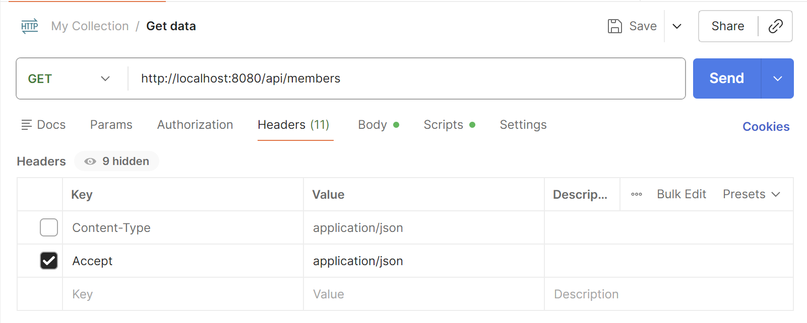
- GET 요청은 Body가 필요 없음
#### 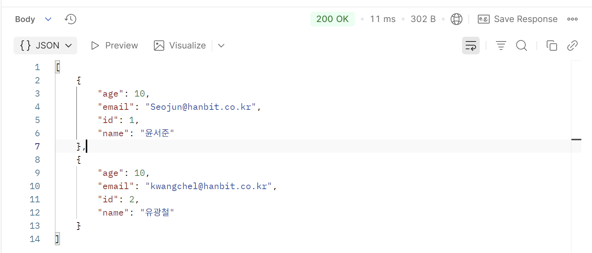

### 특정 회원 조회하기
- POST /api/members로 회원을 생성할 때 데이터베이스에서 자동생성된 아이디를 알 수 있으므로, 이 아이디를 파라미터로 전달해 조회하는 메서드 작성하기
- `@GetMapping("/{id}")`와 같이 파라미터로 URI 경롤르 정의하면 클래스에 적용 경로인 `/api/members`에 추가되어 `/api/members/{id}` 형식의 요청을 처리하게 됨
- 아이디와 같이 URI 경로에 있는 것을 `경로 변수(Path Variable)`라고 함
- 메서드 파라미터 앞에 `@PathVariable("id")`를 사용하면, 스프링 프레임워크가 URI 경로에서 {id}로 설정된 부분으로부터 아이디 값을 가져와 메서드를 호출할 때 해당 파라미터로 전달해줌
- 이렇게 전달된 아이디를 사용해 `memberRepository.findById()`를 호출하면 회원을 검색할 수 있음
- 하지만 `findById()`가 반환하는 것은 `Optional<Member>` 타입으로, 데이터베이스에 해당 아이디를 갖는 회원 정보가 없을 때는 `orElse(null)`을 사용해 null을 반환하도록 해야 함

```java
// controller/MemberController.java
@RestController
@RequestMapping("/api/members")
@RequiredArgsConstructor
public class MemberController {
    private final MemberRepository memberRepository;

    @PostMapping
    public Member post(@RequestBody Member member) {
        return memberRepository.save(member);
    }

    @GetMapping
    public List<Member> getAll() {
        return memberRepository.findAll();
    }

    @GetMapping("/{id}")
    public Member get(@PathVariable("id") Long id) {
        return memberRepository.findById(id).orElse(null);
    }
}
```
#### 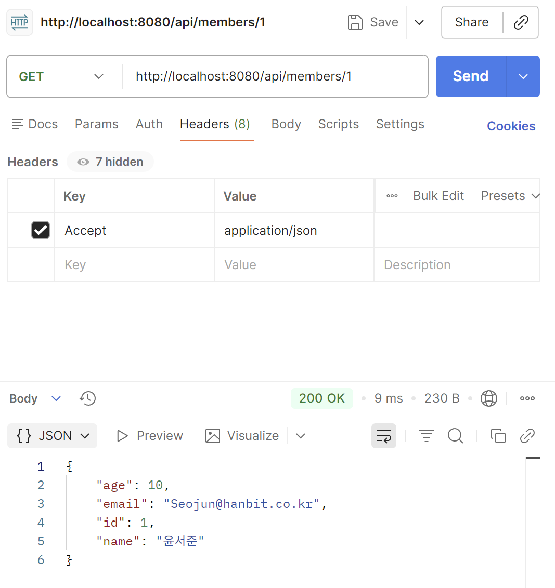
- 없는 회원 아이디를 사용해 조회하는 경우, RESTful API 설계 원칙에 따라 `HTTP 404 Not Found` 오류를 반환해야 함
#### 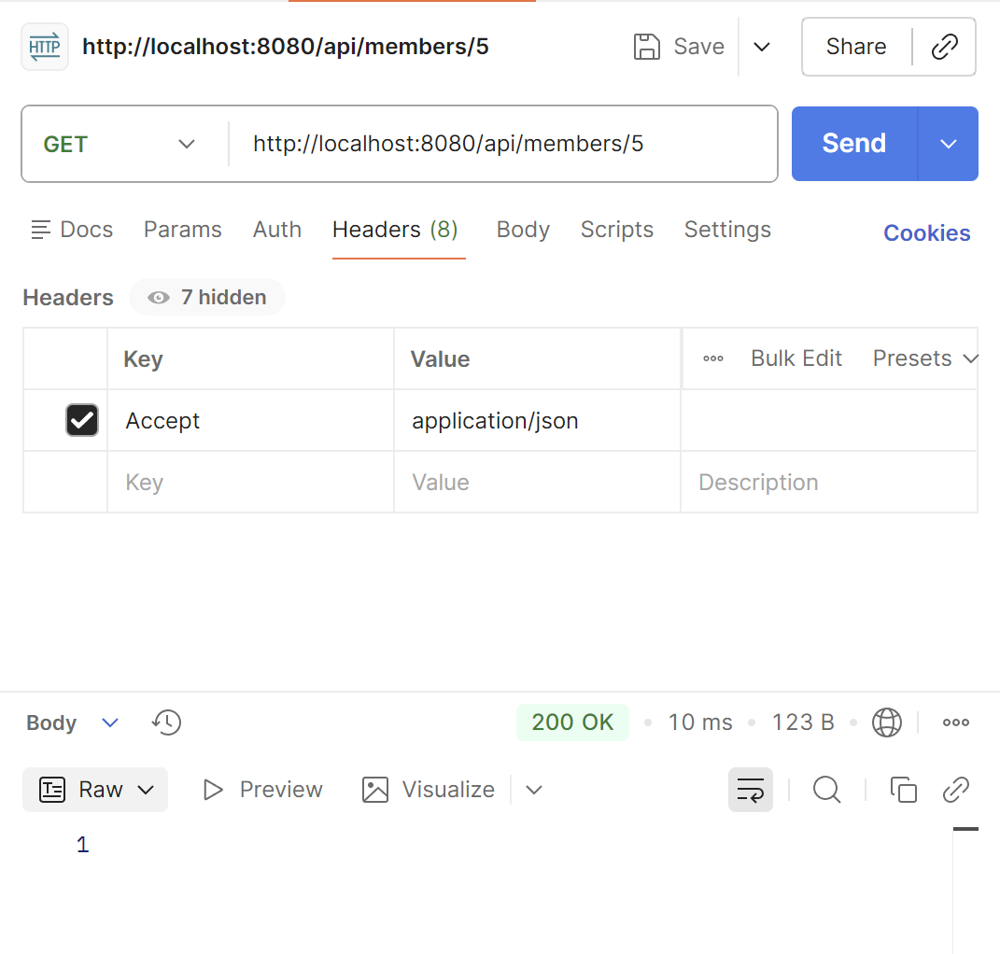

- TODO

### 회원 수정하기
- 회원 정보를 수정하기 위한 HTTP 메서드로는 PUT과 PATCH 두가지가 있음
- PUT
  - 회원 정보를 완전히 대체
- PATCH
  - 일부 정보만 수정

### PUT
- `PutMapping("/{id}")` : 메서드에 정의한 `/{id}`를 추가해 PUT /api/members/{id} 형식의 요청을 처리
- `@PathVariable("id")`를 사용해 경로에서 아이디 값을 가져오고
- `@RequestBody`를 사용해 요청 본문으로부터 회원 정보를 가져와 파라미터로 전달 받음
- 전달된 회원 정보인 member는 경로 파라미터로 전달된 아이디의 회원 정보를 대체할 것이기 때문에 `member.setId()`를 통해 아이디 값을 설정하고 `memberRepository.save()`를 사용해 데이터베이스에 저장할 것
- 리포지터리의 `save()` 메서드는 데이터베이스에 저장한 객체를 그대로 반환하므로, 이 객체를 다시 클라이언트로 반환하면 됨
```java
// controller/MemberController.java
@RestController
@RequestMapping("/api/members")
@RequiredArgsConstructor
public class MemberController {
    private final MemberRepository memberRepository;

    @PostMapping
    public Member post(@RequestBody Member member) {
        return memberRepository.save(member);
    }

    @GetMapping
    public List<Member> getAll() {
        return memberRepository.findAll();
    }

    @GetMapping("/{id}")
    public Member get(@PathVariable("id") Long id) {
        return memberRepository.findById(id).orElse(null);
    }

    @PutMapping("/{id}")
    public Member put(@PathVariable("id") Long id, @RequestBody Member member) {
        member.setId(id);
        return memberRepository.save(member);
    }
}
```
#### 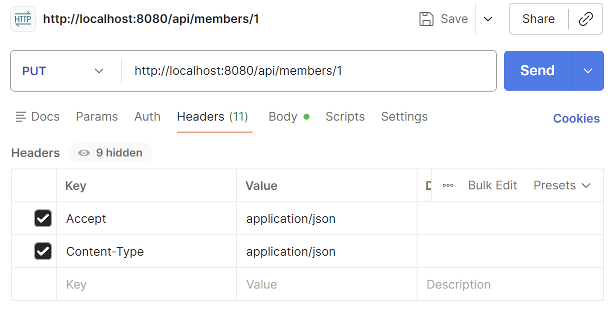
#### 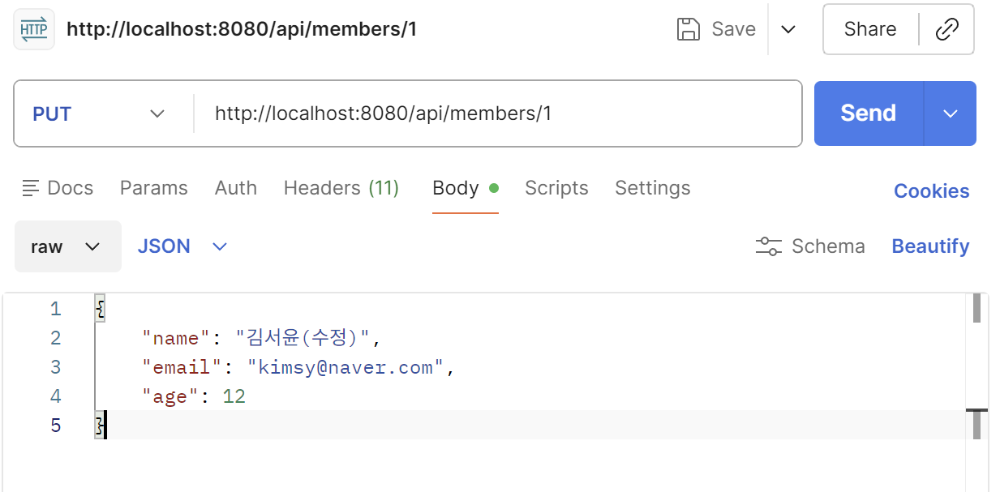
- 만약 email을 빼고 보낸다면?
- 해당 값은 null로 수정될 것
#### 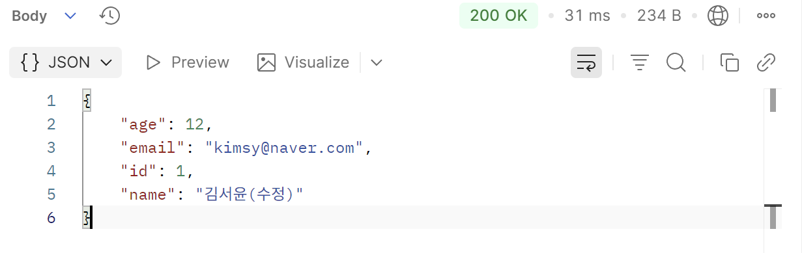
#### 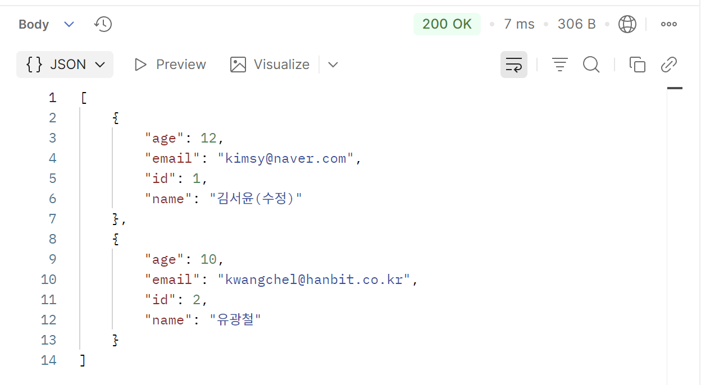

### PATCH
- 우선 아이디로 회원 정보를 조회하고, 전달된 회원 객체의 프로퍼티 중 null이 아닌 것들만 값을 바꿔 데이터베이스에 저장하도록 구현

```java
@RestController
@RequestMapping("/api/members")
@RequiredArgsConstructor
public class MemberController {
    private final MemberRepository memberRepository;

    @PostMapping
    public Member post(@RequestBody Member member) {
        return memberRepository.save(member);
    }

    @GetMapping
    public List<Member> getAll() {
        return memberRepository.findAll();
    }

    @GetMapping("/{id}")
    public Member get(@PathVariable("id") Long id) {
        return memberRepository.findById(id).orElse(null);
    }

    @PutMapping("/{id}")
    public Member put(@PathVariable("id") Long id, @RequestBody Member member) {
        member.setId(id);
        return memberRepository.save(member);
    }

    @PatchMapping("/{id}")
    public Member patch(@PathVariable("id") Long id, @RequestBody Member patch) {
        // 입력 받은 member 인스턴스 이름이 patch
        Member member = memberRepository.findById(id).orElse(null);
        if (member != null) {
            if (patch.getName() != null) member.setName(patch.getName());
            if (patch.getEmail() != null) member.setName(patch.getEmail());
            if (patch.getAge() != null) member.setAge(patch.getAge());
            // 만약 patch에 저장된 값이 null이 아니라면 member의 값을 수정
            memberRepository.save(member); // member로 저장
        }
        return member;
    }
}
```

#### 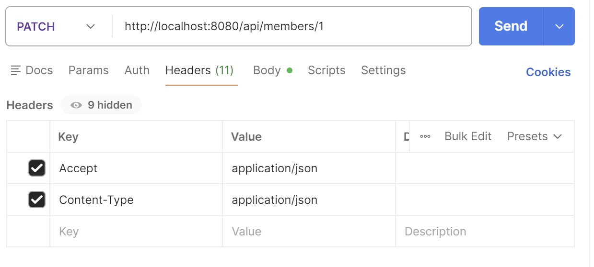
#### 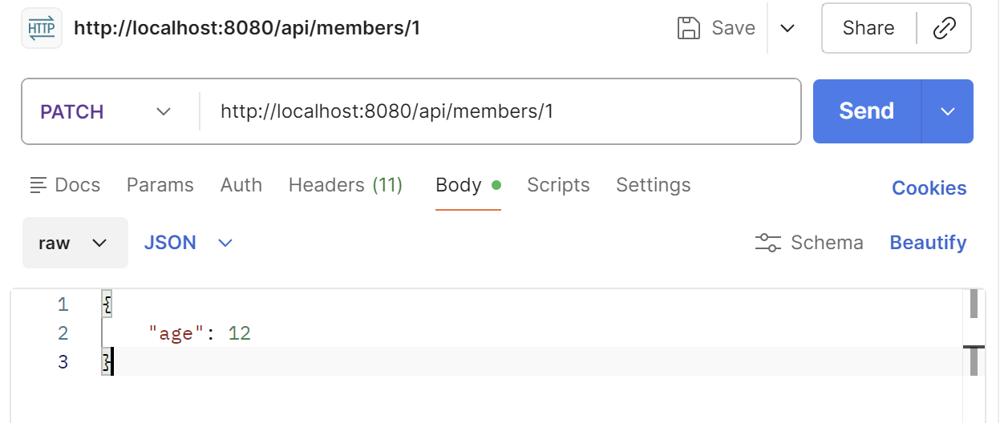
#### 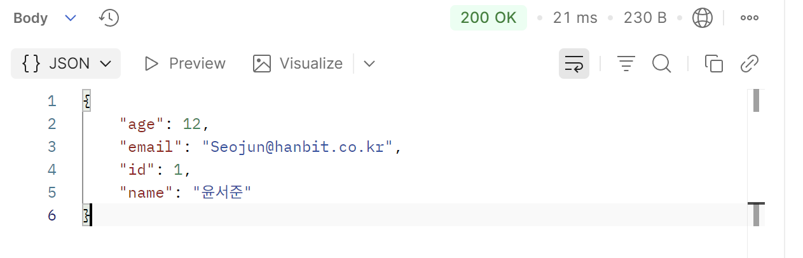

### 회원 삭제
- DELETE /api/members가 호출되면 `memberRepository.deleteAll()`을 호출해 모든 회원을 삭제할 수도 있지만, `DELETE /api/members/{id}`만 구현할 것
- `@DeleteMapping("/{id}")`를 사용해 경로 변수로 아이디를 가져온 후 `memberRepository.deleteById(id)`를 호출해 해당 아이디를 갖는 회원만 삭제

```java
@RestController
@RequestMapping("/api/members")
@RequiredArgsConstructor
public class MemberController {
    private final MemberRepository memberRepository;

    @PostMapping
    public Member post(@RequestBody Member member) {
        return memberRepository.save(member);
    }

    @GetMapping
    public List<Member> getAll() {
        return memberRepository.findAll();
    }

    @GetMapping("/{id}")
    public Member get(@PathVariable("id") Long id) {
        return memberRepository.findById(id).orElse(null);
    }

    @PutMapping("/{id}")
    public Member put(@PathVariable("id") Long id, @RequestBody Member member) {
        member.setId(id);
        return memberRepository.save(member);
    }

    @PatchMapping("/{id}")
    public Member patch(@PathVariable("id") Long id, @RequestBody Member patch) {
        // 입력 받은 member 인스턴스 이름이 patch
        Member member = memberRepository.findById(id).orElse(null);
        if (member != null) {
            if (patch.getName() != null) member.setName(patch.getName());
            if (patch.getEmail() != null) member.setName(patch.getEmail());
            if (patch.getAge() != null) member.setAge(patch.getAge());
            // 만약 patch에 저장된 값이 null이 아니라면 member의 값을 수정
            memberRepository.save(member); // member로 저장
        }
        return member;
    }

    @DeleteMapping("/{id}")
    public void delete(@PathVariable("id") Long id) {
        memberRepository.deleteById(id);
    }
}
```
#### 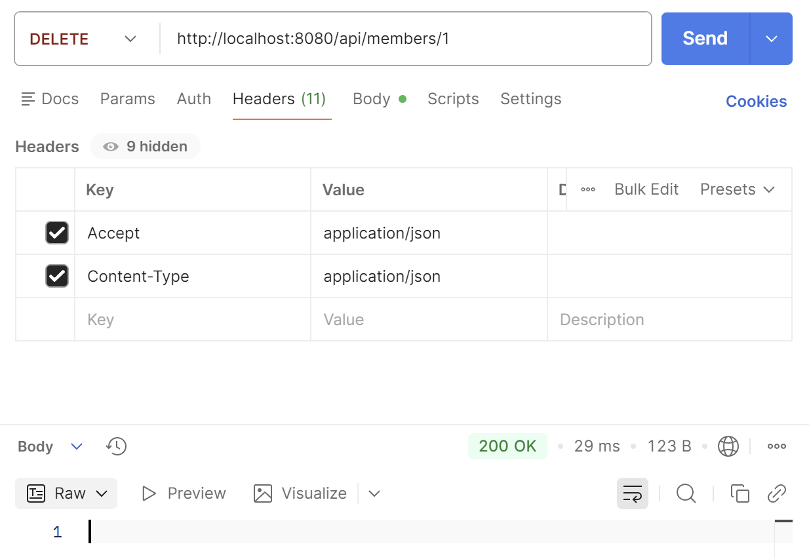
#### 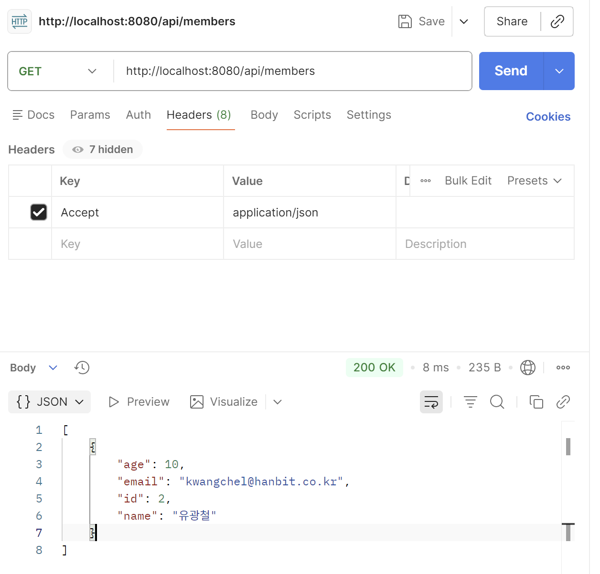


# 에러 발생
## 서버 재실행 없이 진행
- 서버 재실행 없이 이어서 진행하려고 한다면
- 405 Error를 만나게 됨(해당 메소드 허락되지 X)
  
## Id값은 자동으로 할당됨
- id값은 DB의 정책을 따르기로 했기 때문에 POST 시에 포함하지X
- 포함하게 되는 경우 500 Error 발생
  
## 낙관적 락(Optimistic Locking) 실패
### 상황
- java 파일을 수정해서 서버를 다시 시작함. 서버에 등록된 데이터들은 모두 사라지니 다시 회원을 등록하려고 함 → 500 Error 발생
### 설명
- 낙관적 락 = **데이터 충돌**
- 원인
  1. 과거의 흔적 : 서버를 끄기 전, DB에 ID가 1번인 회원이 저장되어 있음
  2. 재시작 & 충돌 : 서버를 다시 켬. 이때 ApplicationRunner에 있는 코드가 실행되면서 ID 1을 또 저장하거나 수정하려고 시도
  3. 엇박자 : DB에 이미 있는 데이터와 지금 넣으려는 데이터의 버전이나 상태가 꼬여서 JPA가 저장을 거부
### 해결 방법
- 스프링부트 설정으로 '매번 초기화' 하기
  - `application.properties`파일을 열어서 설정 수정
  - `spring.jpa.hibernate.ddl-auto=create` : 시작할 때 DB를 다 지우고 새로 만듦
- 또는 DBeaver에서 직접 삭제
  - 설정을 건드리기 싫다면, 수동으로 해결
  1. DBeaver에서 member 테이블의 데이터 확인
  2. 들어있는 데이터를 전부 선택해서 삭제(Delete)하고 저장(Save/Commit)
  3. 서버를 다시 켜거나 PostMan 요청 보내기


# 서비스 계층 분리
- 클라이언트의 요청을 받거나 결과를 전달해주는 `컨트롤러를 표현 계층`이라고 하고, 데이터베이스를 연결하는 `리포지터리를 데이터 영속성 계층`이라고 함
- 지금까지 컨트롤러에서 직접 리포지터리를 사용해 데이터베이스에 접근함
- 일반적으로 리포지터리에서 관리하는 도메인 모델 객체를 그대로 컨트롤러를 통해 클라이언트에 노출하는 것은 권장하지 않음
- 내부 관리 목적의 프로퍼티들 - 내부 프로퍼티들을 외부 클라이언트에게 노출하지 않도록 `컨트롤러와 리포지터리 사이에 비즈니스 로직을 담당하는 서비스 계층을 두고 별도의 데이터 전달용 객체를 사용하는 것이 일반적`
- 하나의 계층에서 다른 계층으로 데이터를 전달하기 위한 목적의 객체를 `DTO(Data Transfer Object)`라고 함
  - 서비스 계층(비즈니스 계층) <-(DTO)-> 외부 표현 계층 <-> REST 클라이언트(포스트맨)
  - 서비스계층 <-(모델객체)-> 리포지터리 <-> DB
- 또한 단순히 몇 가지 프로퍼티만 달리할 수도 있지만, 예를 들어 클라이언트가 요청한 상품 주문(ORDER)객체가 내부적으로는 상품 정보 객체에서 재고를 차감하고 고객 정보 객체에서 포인트를 차감하는 등 고유한 비즈니스 로직을 처리하는 것도 비즈니스 로직을 담당하는 서비스 계층의 역할임
- 따라서 `서비스 계층`에서 제공하는 `API 이름`은 일반적으로 `비즈니스 목적을 담아 placeOrder, getProducts와 같은 형태`를 취하고, 반면에 `데이터 영속성 계층`인 리포지터리에서는 `find, save, delete와 같은 이름`을 갖는다

## DTO 객체 분리와 서비스 객체 생성하기
- 회원 모델 객체에 이름, 이메일, 나이 뿐만 아니라, 내부 관리 목적의 패스워드와 계정 활성화 여부를 저장하는 프로퍼티 2개를 추가
```java
// model/Member.java
package com.example.demo.model;

import jakarta.persistence.Entity;
import jakarta.persistence.GeneratedValue;
import jakarta.persistence.GenerationType;
import jakarta.persistence.Id;
import lombok.Data;

@Entity
@Data
public class Member {
    @Id
    @GeneratedValue(strategy = GenerationType.IDENTITY)
    private Long id;
    private String name;
    private String email;
    private Integer age;
    // 내부 관리 목적의 속성
    private String password;
    private Boolean enabled;
}
```
- 정의한 모델 객체와 달리 클라이언트와 주고 받는 회원 정보는 이름, 이메일, 나이 3가지만 있는 형태로 만들기 위해 DTO 객체 분리
- 클라이언트가 요청할 때는 회원 아이디가 없고, 결과를 전달할 때만 아이디가 들어가므로 요청할 때 사용하는 객체와 반환할 때 사용하는 객체도 분리
- DTO 객체들은 `dto`라는 패키지 아래에 모아 두는 것이 일반적 → dot 패키지를 만들고 MemberRequest 객체와 MemberResponse 객체 작성
- 이 객체들은 데이터베이스 테이블과 매핑하기 위한 객체가 아니므로 `@Entity`나 `@Id`와 같은 애노테이션은 필요X
- 두 객체 간 유일한 차이점은 요청 객체에는 아이디 프로퍼티가 없지만, 반환 객체에는 아이디 프로퍼티가 있다는 것
- `@Builder`를 추가한 이유는 도메인 모델 객체로 DTO 객체를 만들거나 DTO 객체로 도메인 모델 객체를 만드는 일이 빈번하기 때문에, 빌더 패턴을 사용해 가독성을 높일 수 있음

#### 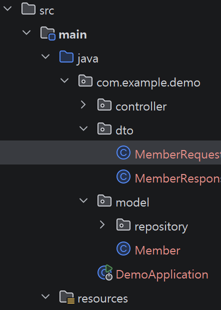
```java
// dto/MemberRequest.java
package com.example.demo.dto;

import lombok.Builder;
import lombok.Data;

@Data
@Builder
public class MemberRequest {
    private String name;
    private String email;
    private Integer age;
}
```
```java
// dto/MemberResponse.java
package com.example.demo.dto;

import lombok.Builder;
import lombok.Data;

@Data
@Builder
public class MemberResponse {
    private Long id;
    private String name;
    private String email;
    private Integer age;
}
```
- 애플리케이션이 시작되면 스프링 프레임워크는 `@Service`라는 애노테이션이 사용된 모든 클래스를 객체로 만들어 스프링 컨테이너에 두고 관리함
- `@Service` : 서비스 객체를 만들기 위해 사용
- 컨트롤러 대신 서비스 객체가 직접 리포지터리를 사용할 것 → 생성자를 통해 회원 리포지터리 객체를 전달 받음
- 회원 도메인 모델 객체 Member를 DTO 객체로 변환하기 위해 mapToMemberResponse 구현

### 회원 등록하기
```java
package com.example.demo.service;

import com.example.demo.dto.MemberRequest;
import com.example.demo.dto.MemberResponse;
import com.example.demo.model.Member;
import com.example.demo.model.repository.MemberRepository;
import lombok.RequiredArgsConstructor;
import org.springframework.stereotype.Service;

import java.util.ArrayList;
import java.util.List;

@Service
@RequiredArgsConstructor
public class MemberService {
    private final MemberRepository memberRepository;

    // 사용자 등록하기
    public MemberResponse create(MemberRequest memberRequest) {
        Member member = Member.builder()
                .name(memberRequest.getName())
                .email(memberRequest.getEmail())
                .age(memberRequest.getAge())
                .enabled(true).build();
        memberRepository.save(member);
        return mapToMemberResponse(member);
    }

    private MemberResponse mapToMemberResponse(Member member) {
        // DTO 객체 - memberResponse객체를 반환
        return MemberResponse.builder()
                .id(member.getId())
                .name(member.getName())
                .email(member.getEmail())
                .age(member.getAge())
                .build();
    }

}
```
```java
package com.example.demo.controller;

import com.example.demo.dto.MemberRequest;
import com.example.demo.dto.MemberResponse;
import com.example.demo.model.Member;
import com.example.demo.model.repository.MemberRepository;
import com.example.demo.service.MemberService;
import lombok.RequiredArgsConstructor;
import org.springframework.http.HttpStatus;
import org.springframework.web.bind.annotation.*;

import java.util.List;

@RestController
@RequestMapping("/api/members")
@RequiredArgsConstructor
public class MemberController {
    private final MemberRepository memberRepository;
    private final MemberService memberService;

    @PostMapping
    @ResponseStatus(HttpStatus.CREATED)
    public MemberResponse post(@RequestBody MemberRequest memberRequest) {
        return memberService.create(memberRequest);
//        return memberRepository.save(member);
    }

    //...
}
```

### 회원 전체 조회
```java
package com.example.demo.service;

import com.example.demo.dto.MemberRequest;
import com.example.demo.dto.MemberResponse;
import com.example.demo.model.Member;
import com.example.demo.model.repository.MemberRepository;
import lombok.RequiredArgsConstructor;
import org.springframework.stereotype.Service;

import java.util.ArrayList;
import java.util.List;

@Service
@RequiredArgsConstructor
public class MemberService {
    private final MemberRepository memberRepository;

    // 사용자 등록하기
    public MemberResponse create(MemberRequest memberRequest) {
        Member member = Member.builder()
                .name(memberRequest.getName())
                .email(memberRequest.getEmail())
                .age(memberRequest.getAge())
                .enabled(true).build();
        memberRepository.save(member);
        return mapToMemberResponse(member);
    }

    // 사용자 전체 조회
    public List<MemberResponse> findAll() {
        List<Member> members = memberRepository.findAll();
        List<MemberResponse> memberResponses = new ArrayList<>();
        for (Member member : members) {
            MemberResponse memberResponse = mapToMemberResponse(member);
            memberResponses.add(memberResponse);
        }
        return memberResponses;
    }

    private MemberResponse mapToMemberResponse(Member member) {
        // DTO 객체 - memberResponse객체를 반환
        return MemberResponse.builder()
                .id(member.getId())
                .name(member.getName())
                .email(member.getEmail())
                .age(member.getAge())
                .build();
    }
}
```
- 회원 목록 전체 조회
  - 리포지터리의 `findAll()`을 사용해 전체 목록을 가져온다
  - for 반복문을 사용해 MemberResponse DTO 객체로 변환하고
  - 이를 다시 리스트에 추가하여 반환
- 스프링부트 애플리케이션을 개발할 때는 이러한 반복문보다는 자바 스트림과 람다 형식을 사용해 코딩의 양을 줄이고 가독성을 높이는 것이 일반적
- `findAll()로 가져온 리스트에서 사용자 모델 객체를 하나씩 스트림으로 보내고 새로운 DTO 객체로 매핑한 후 다시 리스트(`toList`)로 만듭니다

```java
@Service
@RequiredArgsConstructor
public class MemberService {
    private final MemberRepository memberRepository;

    // 사용자 등록하기
    public MemberResponse create(MemberRequest memberRequest) {
        Member member = Member.builder()
                .name(memberRequest.getName())
                .email(memberRequest.getEmail())
                .age(memberRequest.getAge())
                .enabled(true).build();
        memberRepository.save(member);
        return mapToMemberResponse(member);
    }

    // 사용자 전체 조회
    public List<MemberResponse> findAll() {
        // 람다 이용하여 코드 양 줄이고 가독성 높이기
        return memberRepository
                .findAll()
                .stream()
                .map(this::mapToMemberResponse)
                .toList();
    }


    private MemberResponse mapToMemberResponse(Member member) {
        // DTO 객체 - memberResponse객체를 반환
        return MemberResponse.builder()
                .id(member.getId())
                .name(member.getName())
                .email(member.getEmail())
                .age(member.getAge())
                .build();
    }
}
```
```java
@RestController
@RequestMapping("/api/members")
@RequiredArgsConstructor
public class MemberController {
    private final MemberRepository memberRepository;
    private final MemberService memberService;

    @PostMapping
    @ResponseStatus(HttpStatus.CREATED)
    public MemberResponse post(@RequestBody MemberRequest memberRequest) {
        return memberService.create(memberRequest);
//        return memberRepository.save(member);
    }

    @GetMapping
    public List<MemberResponse> getAll() {
        return memberService.findAll();
    }
}
```